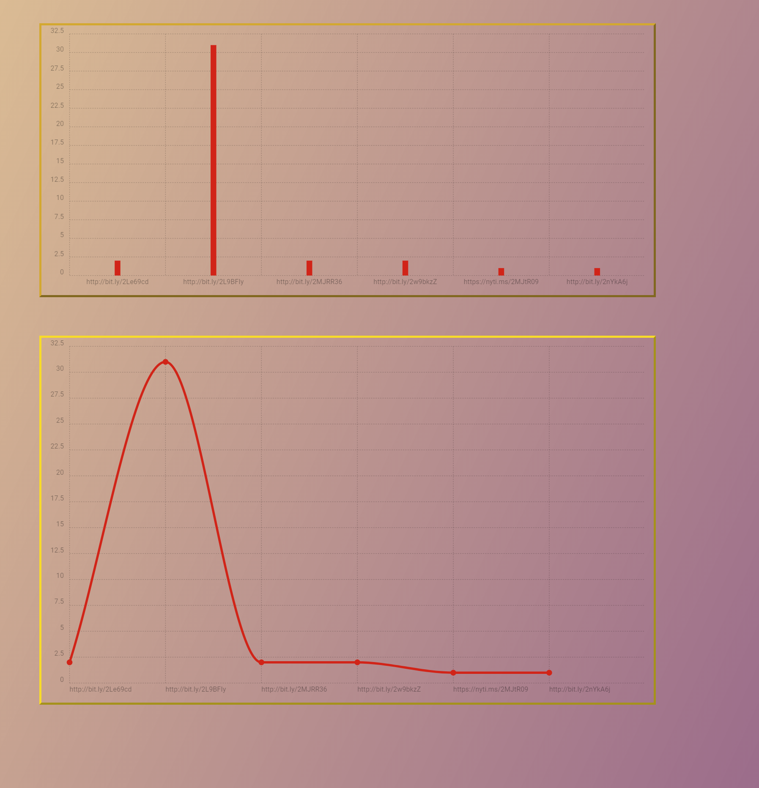
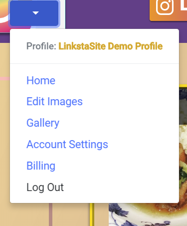
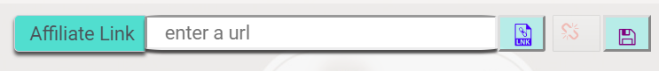
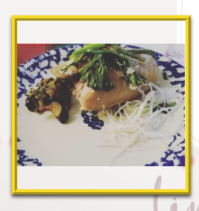
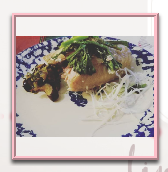
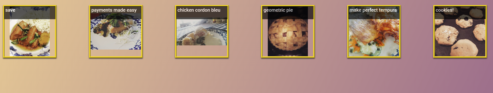

# LinkstaSite    

   
  ```These credentials are provided in order to test out this app:```    
          
           LinkstaSite username/email: me@mail.com   
                             password: password

           Instagram username: DemoProject99
                     password: password    
              
After logging into linkstasite you will automatically be asked to sign in with Instagram.  

#### Add affiliate links to your Instagram gallery images  

This app uses React and Firebase as well as Re-base.  React context api is used as well but very sparingly.  and requires that the user sign up for a developer account through instagram in order to make use of their api.  However, the demo for this app has a demo profile for the purposes of exploring the functionality. If you wish to create a developer account, you may do that [here](https://www.instagram.com/developer/register/). The demo  is setup only to display the demo instagram profile regardless if you sign into your instagram account from within this app.  

This app was originally a capstone project that got scrapped and I later picked it up to do on my spare time.  Being as such it's a little buggy, but the intention was to be able to come back to this from time to time and stay sharp and practice.  
          
  

The first page is basically what the images look like after theyve been edited- it will be what you present to your guests. in the upper right hand side of the header there are two links- one to enter the app if you're already authenticated and one to log in.  They are hard to see on purpose as this page is primarily for guests to see.  
      

Clicking on an image will bring up a modal with an affiliate link linked to the title as well as a link preview right beside it, and an instagram avatar in the lower corner.   
  
    
    



The home page is a dashboard that will display analytics for the links you associate with your instagram gallery.  Links are sent to bit.ly and each link is unique so you don't end up using duplicates.  



  There are a couple ways to navigate: the user dropdown menu and header, and the sidemenu. First, 

in the uper left part of the header/ navigation menu there will be a drop down menu. this is pretty straight forward.  

  

in the upper right side or directly to the opposite side of the user dropdown menu there is a home button, finished gallery view button, and logout button

      

on the left side you will always see the sidemenu which has (from top to bottom) fetch gallery button, edit mode button, gallery preview button, and information / help button.

   

The edit mode allows you to make changes to your images.  Sometimes it is easy to forget what the original affiliate link was so there is a link preview switch as you can see in the pics above.

   

You will enter your original url in the field and click the link button.  If the link is valid it will come back like the picture below.  


    
This is the url field after a link has been entered.


  
  

      

images that have an affiliate link will have a gold border while the ones that do not will have a rose colored border.


    

only images that have affiliate links will show up in the gallery preview mode.  Here you can see the title that has been saved and test that your links are working by clicking the images.  The intention is to provide a link that users may place on their original instigram page- since only one affiliate link is allowed, which will lead them to the first guest page where the app started out.

